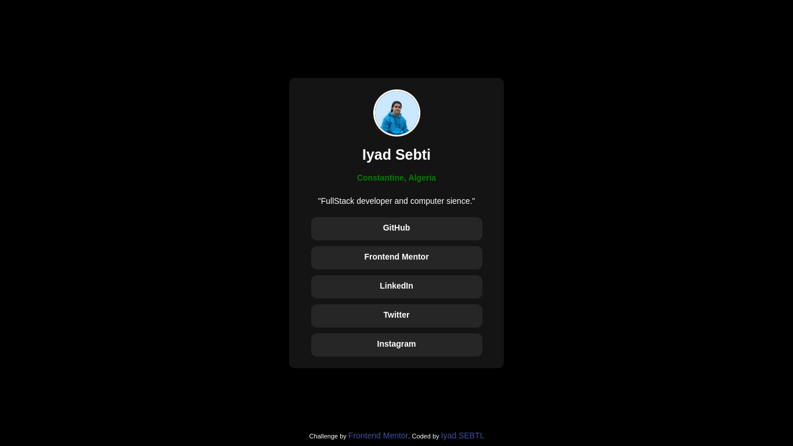
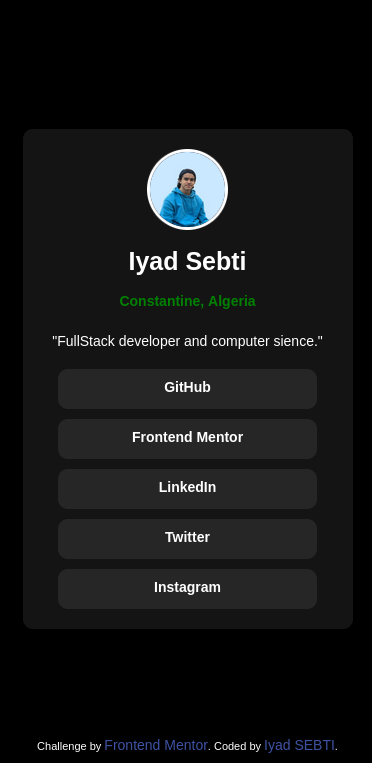

# Social links profile solution

This is a solution to the [Social links profile challenge on Frontend Mentor](https://www.frontendmentor.io/challenges/social-links-profile-UG32l9m6dQ). Frontend Mentor challenges help you improve your coding skills by building realistic projects. 

## Table of contents

- [Overview](#overview)
  - [The challenge](#the-challenge)
  - [Links](#links)
- [My process](#my-process)
  - [Built with](#built-with)
- [Author](#author)
- [Screenshot](#screenshot)

## Overview

### The challenge

Users should be able to:

- See hover and focus states for all interactive elements on the page

### Links

- Solution URL: [https://github.com/Uyadsb/Social-links-profile](https://github.com/Uyadsb/Social-links-profile)
- Live Site URL: [https://uyadsb.github.io/Social-links-profile](https://uyadsb.github.io/Social-links-profile)

## My process

### Built with

- Semantic HTML5 markup
- CSS custom properties
- Flexbox

## Author

- Frontend Mentor - [@Uyadsb](https://www.frontendmentor.io/profile/uyadsb)
- LinkedIN - [@uyadsb](https://www.linkedin.com/in/iyad-sebti)

## Screenshot

